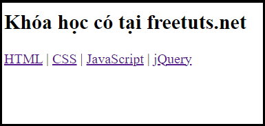

# HTML Semantic Elements
---

Bài viết này được tham khảo tran w3schools.com và một số nguồn khác.

---

## Phụ lục
[I. HTML Semantic là gì ?](#html-semantic-elements)\
[II. Các phần tử Semantic trong HTML](#ii-các-phần-tử-semantic-trong-html)\
[III. Một số thẻ Semantic trong HTML](#iii-một-số-thẻ-semantic-trong-html)\
    &nbsp; &nbsp;  [1. Thẻ *<section*> ](#1-thẻ-section) \
    &nbsp; &nbsp;   [2. Thẻ *<article*>](#2-thẻ-article)\
    &nbsp; &nbsp;   [3. Có thể lồng ghép thẻ *<article*> trong thẻ *<*section> hoặc ngược lại ?](#3-thẻ-article-có-thể-ở-trong-section-hoặc-ngược-lại)\
    &nbsp; &nbsp;   [4. Thẻ *<header*>](#4-thẻ-header)\
    &nbsp; &nbsp;   [5. Thẻ *<footer*>](#4-thẻ-header)\
    &nbsp; &nbsp;   [6. Thẻ *<nav*>](#6-thẻ-nav)\
    &nbsp; &nbsp;   [7. Thẻ *<aside*>](#7-thẻ-aside)\
    &nbsp; &nbsp;   [8. Thẻ *<figure*> và *<figcation*>](#8-thẻ-figure-và-figcation)\
[IV. Một số thẻ phụ](#iv-một-số-thẻ-phụ)\
[V. Tại sao sử dụng Semantic Element và phần kết](#v-tại-sao-sử-dụng-semantic-element-và-phần-kết)

---

### I. HTML Semantic là gì ?
Semantic hay tên gọi đầy đủ là Semantic Elements khi dịch ra tiếng Việt nôm na hiểu rằng là "phần tử có nghĩa."
\
Một Semantic Elements phải định nghĩa đầy đủ ý nghĩa của nó cho trình duyệt web và lập trình viên
Có ai hai loại Semantic đó là : **non-semantic** và **semantic**

* <b>Non-semantic</b> là những thẻ không có định nghĩa rõ ràng, ví dụ như : thẻ  ``*<div*>`` dùng để định nghĩa một thành phần hay một bộ phận,hay dùng để định nghĩa một class , ví dụ như `*<div class="image"*>` , vì nó dùng để định nghĩa định nghĩa một thành phần hay bộ phận nên nó không có chức năng. Hay thẻ ``<span>`` chỉ dùng để chứa đánh dấu thuộc tính style,CSS hoặc Javascript , ví dụ như :
``<p>My mother has <span style="color:blue">blue</span> eyes.</p>``\
thì thẻ ``<span>`` định nghĩa thuộc tính ``style`` của nó là ``"color:blue"`` nghĩa là màu chữ blue là màu xanh biển.
* Thẻ Semantic là thẻ có định nghĩa rõ ràng về thành phần rõ ràng và có thể sử dụng cho những thành phần khác trong web

Công cụ hỗ trợ 


Hầu hết các trình duyệt mới hiện nay đều hỗ trợ semantic elements.

### II. Các phần tử Semantic trong HTML
Rất nhiều trang web chứa các thẻ HTML được lập trình viên code như : ``<div id="nav> <div id ="header"> <div id="footer>`` để định nghĩa về nav,header và footer
Trong HTML,có những phần tử có nghĩa được định nghĩa để sử dụng các phần khác nhau trong trang web như :    
+ `<article>`
+ `<aside>`
+ `<details>`
+ `<figcaption>`
+ `<figure>`
+ `<footer>`
+ `<header>`
+ `<main>`
+ `<mark>`
+ `<nav>`
+ `<section>`
+ `<summary>`
+ `<time>`


---

### III. Một số thẻ Semantic trong HTML

#### 1. Thẻ *<section*>
**Element `<section>`** đại diện cho một phần chung có trong tài liệu hoặc ứng dụng.

Cụ thể hơn, một section là một nhóm các nội dung có cùng chủ đề.

Ví dụ: trang chủ của một trang web có thể được chia thành các section như giới thiệu, nội dung, thông tin liên lạc, góp ý…
>`<section>`
    ` ` ` ` `<h2>Giới thiệu Doraemon</h2>`
    ` ` ` ` `<p>Doraemon là nhân vật chính hư cấu trong loạt Manga cùng tên của họa sĩ Fujiko F. Fujio. Trong truyện lấy bối cảnh ở thế kỷ 22, Doraemon là chú mèo robot của tương lai do xưởng Matsushiba — công xưởng chuyên sản xuất robot.</p>`
`</section>`
` `   
`<section>`
    ` ` ` ` `<h2>Sứ mệnh của Doraemon</h2>`
    ` ` ` ` `<p>Giúp đỡ Nobita và những trẻ em khác.</p>`
`</section>`

Khi render ra kết quả sẽ là:

<pre>
    <code>
    <section>
        <h2>Giới thiệu Doraemon</h2>
        <p>Doraemon là nhân vật chính hư cấu trong loạt Manga cùng tên của họa sĩ Fujiko F. Fujio. Trong truyện lấy bối cảnh ở thế kỷ 22, Doraemon là chú mèo robot của tương lai do xưởng Matsushiba — công xưởng chuyên sản xuất robot. </p>
    </section>

        <section>
        <h2>Sứ mệnh của Doraemon</h2>
        <p>Giúp đỡ Nobita và những trẻ em khác.</p>
       </section>
    </code>
</pre>

#### 2. Thẻ *<article*>
**Element `<article>`** được sử dụng cho các nội dung độc lập và chứa nội dung của riêng nó. Nội dung bên trong **`<article>`** có ý nghĩa riêng biệt và có thể độc lập với các nội dung khác của trang web.

#### 3. Thẻ *<article*> có thể ở trong *<section*> hoặc ngược lại ?

Để trả lời câu hỏi trên chúng ta cần nên phải biết bản chất hai thẻ này :
* Thẻ ``<article>`` là element độc lập,khép kín
* Thẻ ``<section>`` là element xác định một phần chung trong tài liệu 

Vậy bạn đã có câu trả lời cho việc thẻ ``<article>`` có ở trong thẻ ``<section>`` rồi ? Câu trả lời đó là không ! Bởi vì các phần tử ``<section>`` chứa các phần tử ``<article>``.Đây là ví dụ về nó trích câu hỏi ở Stackoverflow (https://stackoverflow.com/questions/9527378/should-sections-have-articles-or-should-articles-have-sections) :

```
<section><h1>section article?</h1>
  <article><h1>art 1</h1>
    <section><h1>sec 1.1</h1></section>
    <section><h1>sec 1.2</h1></section>
    <section><h1>sec 1.3</h1></section>
  </article>
  <article><h1>art 2</h1>
    <section><h1>sec 2.1</h1></section>
    <section><h1>sec 2.2</h1></section>
    <section><h1>sec 2.3</h1></section>
  </article>
  <article><h1>art 3</h1>
    <section><h1>sec 3.1</h1></section>
    <section><h1>sec 3.2</h1></section>
    <section><h1>sec 3.3</h1></section>
  </article>
</section>
```

Kết quả render:
<pre>
    <code>
<section><h1>section article?</h1>
    <article><h1>art 1</h1>
        <section><h1>sec 1.1</h1></section>
        <section><h1>sec 1.2</h1></section>
        <section><h1>sec 1.3</h1></section>
</article>
    <article><h1>art 2</h1>
        <section><h1>sec 2.1</h1></section>
        <section><h1>sec 2.2</h1></section>
        <section><h1>sec 2.3</h1></section>
</article>
    <article><h1>art 3</h1>
        <section><h1>sec 3.1</h1></section>
        <section><h1>sec 3.2</h1></section>
        <section><h1>sec 3.3</h1></section>
</article>
</section>
    </code>
</pre>


#### 4. Thẻ *<header*>
**Element `<header>`** xác định phần đầu của một trang tài liệu hay phần đầu của một đoạn. Nó được sử dụng như một containter chứa nội dung giới thiệu hoặc mở đầu.

Chúng ta có thể sử dụng một hoặc nhiều phần tử **`<header>`** trong một tài liệu.

>`<article>`
  ` ` ` ` `<header>`
    ` ` ` ` `<h1>WWF làm gì?</h1>`
    ` ` ` ` `<p>Sứ mệnh của WWF:</p>`
  `</header>`
  ` ` ` ` `<p>Sứ mệnh của WWF là ngăn chặn sự xuống cấp môi trường tự nhiên của hành tinh chúng ta và xây dựng một tương lai trong đó con người sống hài hòa với thiên nhiên.</p>`
`</article>`

Kết quả render ra:
<pre>
<code>
    <article>
        <header>
    <h1>WWF làm gì?</h1>
    <p>Sứ mệnh của WWF:</p>
        </header>
    <p>Sứ mệnh của WWF là ngăn chặn sự xuống cấp môi trường tự nhiên của hành tinh chúng ta và xây dựng một tương lai trong đó con người sống hài hòa với thiên nhiên.</p>
    </article>
</code>
</pre>

#### 5. Thẻ *<footer*>
>`<footer>`
  ` ` ` ` `<p>Liên hệ với chúng tôi</p>`
  ` ` ` ` `<p>13F Keangnam Landmark 72 Tower, Plot E6, Pham Hung Road, Nam Tu Liem District., Ha Noi</p>`
  ` ` ` ` `<p>Thời gian làm việc: Từ 7h45 - 15:45h (Thứ 2 đến thứ 6)</p>`
  ` ` ` ` `<p>Hotline: 84-24-3795-5417</p>`
`</footer>`

Kết quả render:
<pre>
<code>
    <footer>
  <p>Thời gian làm việc: Từ 7h45 - 15:45h (Thứ 2 đến thứ 6)</p>
  <p>Hotline: 84-24-3795-5417</p>
    </footer>
</code>
</pre>

#### 6. Thẻ *<nav*>
**Thẻ `<nav>`** được dùng để bao bọc các vị trí liên quan đến liên kết và điều hướng chính cho trang web. Thường đó sẽ là các menu chính, menu phụ, danh sách chuyên mục bên sidebar ...
Nav là từ viết tắt của navigation
>`<h2>Khóa học có tại freetuts.net</h2>`
`<div>`
` ` ` ` `<nav>`
` ` ` ` ` ` ` <a href="#">HTML</a> | `
` ` ` ` ` ` ` <a href="#">CSS</a> | `
` ` ` ` ` ` ` <a href="#">JavaScript</a> | `
` ` ` ` ` ` ` <a href="#">jQuery</a> `
` ` ` ` `</nav>`
`</div>`

Kết quả render ra (Sử dụng ảnh render không thể xuất ra trong Markdown như mong muốn)


#### 7. Thẻ *<aside*>
Thẻ ``<aside>`` có tác dụng định nghĩa bên ngoài nội dung chính.Nó có thể chứa tất cả tag định dạng khác nhau trong HTML


```<p>My family and I visited The Epcot center this summer. The weather was nice, and Epcot was amazing! I had a great summer together with my family!</p>

<aside>
<h4>Epcot Center</h4>
<p>Epcot is a theme park at Walt Disney World Resort featuring exciting attractions, international pavilions, award-winning fireworks and seasonal special events.</p>
</aside>
```

Kết quả render xuất ra:
<pre>
    <code>
        <p>My family and I visited The Epcot center this summer. The weather was nice, and Epcot was amazing! I had a great summer together with my family!</p>

        <aside>
        <h4>Epcot Center</h4>
        <p>Epcot is a theme park at Walt Disney World Resort featuring exciting attractions, international pavilions, award-winning fireworks and seasonal special events.</p>
</aside>
    </code>
</pre>

#### 8. Thẻ *<figure*> và *<figcation*>
Đối với hai thẻ này thì ta phân tích lần lượt thẻ ``<figure>`` có chức năng bao quanh làm cha của thẻ ``<figcation>`` thường được chứa các bức ảnh,code,video.Còn thẻ ``<figcation>`` có chức năng chức caption ở dưới bức ảnh,video,hay code đó,ví dụ:

```
<figure>
    
    <figcation> Anh Phan ngồi với mấy thằng điên ngồi giữa đường phố </figcaiton>
</figure>
```

Kết quả render là:
<pre>
    <figure>
        
        <figcation> Anh Phan ngồi với mấy thằng điên ngồi giữa đường phố </figcaiton>
    </figure>
</pre>

### IV. Một số thẻ phụ 
Ngoài ra có một số thẻ phụ như: 
|**Element**|**Ý nghĩa**|
|:----------|:----------|
|`<article>`|Xác định một bài viết/bài báo|
|`<aside>`|Xác định nội dung nằm bên cạnh nội dung của trang|
|`<details>`|Xác định các chi tiết mà người dùng có thể xem hoặc ẩn|
|`<figcaption>`|Chú thích cho thẻ `<figure>`|
|`<figure>`|Đánh dấu nội dung ảnh trong tài liệu|
|`<footer>`|Xác định phần cuối của một trang tài liệu hay một đoạn|
|`<header>`|Xác định phần đầu của một trang tài liệu hay một đoạn|
|`<main>`|Chỉ định các nội dung chính của một tài liệu|
|`<mark>`|Xác định vùng đánh dấu/làm nổi bật văn bản|
|`<nav>`|Xác định một khu vực chứa các link điều hướng|
|`<section>`|Xác định một phần trong tài liệu|
|`<summary>`|Hiển thị tiêu đề cho phần tử `<details>`|
|`<time>`|Xác định ngày/giờ|


### V. Tại sao sử dụng Semantic Element và phần kết
Trong HTML4 và các bản cũ hơn, các lập trình viên thường phải tạo tên các thuộc tính riêng để thiết kế các phần như: header, top, bottom, footer, menu, navigation, main, container, content, article, sidebar, topnav…

Điều này khiến công cụ tìm kiếm không thể xác định nội dung có bên trong trang web chính xác.

Trong HTML5, các element như: **`<header> <footer> <nav> <section> <article>`** làm cho mọi thứ trở nên dễ dàng hơn rất nhiều.

Và theo WW3 (World Wide Web) phát biểu rằng : "A semantic Web allows data to be shared and reused across applications, enterprises, and communities."

Dịch ra rằng: "Một trang web có nghĩa sẽ cho phép chia sẻ và tái sử dụng sang các ứng dụng , thương mại và cộng đồng ".

**Kết luận**

Như vậy, qua bài viết này hi vọng các bạn có thể hiểu thêm được chính xác hơn về **semantic element** và sử dụng chúng một cách dễ dàng hơn. Cảm ơn các bạn đã đọc và lắng nghe bài viết này của nhóm chúng mình.

---
#### Thành viên nhóm:
|**Tên thành viên**|**Chức vụ**|**MSSV**|
|:-----------------|:----------|:-------|
|Bùi Bảo Lâm|Trưởng nhóm|0306221136|
|Nguyễn Hoàng Minh Thông|Phó nhóm|0306221175|
|Huỳnh Trung Hiếu|Thành viên|0306221120|
|Võ Minh Quân|Thành viên|0306221160|
|Lê Xuân Thành|Thành viên|0306221168|


