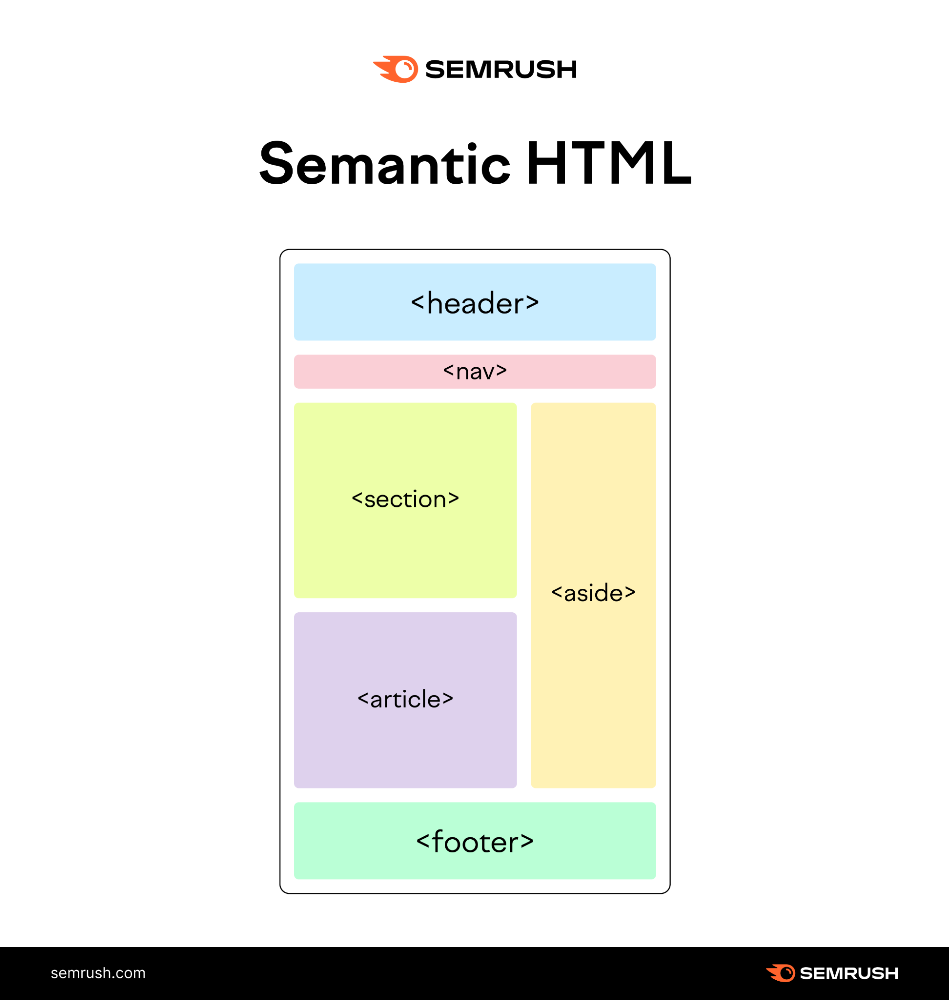

# HTML Semantic Elements

Bài viết này được tham khảo tran w3schools.com và một số nguồn khác.

## Phụ lục
[I. HTML Semantic là gì ?](#html-semantic-elements)
[II. Các phần tử Semantic trong HTML](#)
[III. Một số thẻ Semantic trong HTML](#)
    &nbsp; &nbsp;  [1. Thẻ *<section*> ](#ii-các-phần-tử-semantic-trong-html) 
    &nbsp; &nbsp;   [2. Thẻ *<article*>](#)
    &nbsp; &nbsp;   [3. Có thể lồng ghép thẻ *<article*> trong thẻ *<*section> hoặc ngược lại ?](#)
    &nbsp; &nbsp;   [4. Thẻ *<header*>](#)
    &nbsp; &nbsp;   [5. Thẻ *<footer*>](#)
    &nbsp; &nbsp;   [6. Thẻ *<nav*>](#)
    &nbsp; &nbsp;   [7. Thẻ *<aside*>](#)
    &nbsp; &nbsp;   [8. Thẻ *<figure*> và *<figcation*>](#)
[IV. Một số thẻ phụ và demo của nó](#)
[V. Tại sao sử dụng Semantic Element và phần kết](#)

### I. HTML Semantic là gì ?
Semantic hay tên gọi đầy đủ là Semantic Elements khi dịch ra tiếng Việt nôm na hiểu rằng là "phần tử có nghĩa."
\
Một Semantic Elements phải định nghĩa đầy đủ ý nghĩa của nó cho trình duyệt web và lập trình viên
Có ai hai loại Semantic đó là : **non-semantic** và **semantic**
\
<b>Non-semantic</b> là những thẻ không có định nghĩa rõ ràng, ví dụ như : thẻ  ``*<div*>`` dùng để định nghĩa một thành phần hay một bộ phận,hay dùng để định nghĩa một class , ví dụ như `*
` , vì nó dùng để định nghĩa định nghĩa một thành phần hay bộ phận nên nó không có chức năng. Hay thẻ ```` chỉ dùng để chứa đánh dấu thuộc tính style,CSS hoặc Javascript , ví dụ như :
``
My mother has blue eyes.
``\
thì thẻ ```` định nghĩa thuộc tính ``style`` của nó là ``"color:blue"`` nghĩa là màu chữ blue là màu xanh biển ,xuất ra kết quả:
<pre>
    <code>
My mother has blue eyes.
</code>
</pre>

### II. Các phần tử Semantic trong HTML
Rất nhiều trang web chứa các thẻ HTML được lập trình viên code như : ``
 
 
`` để định nghĩa về nav,header và footer
Trong HTML,có những phần tử có nghĩa được định nghĩa để sử dụng các phần khác nhau trong trang web như :    
+ `<article>` 
+ `<aside>`
+ `
`
+ `<figcaption>`
+ `<figure>`
+ `<footer>`
+ `<header>`
+ `<main>`
+ `<mark>`
+ `<nav>`
+ `<section>`
+ `
`
+ `<time>`

    